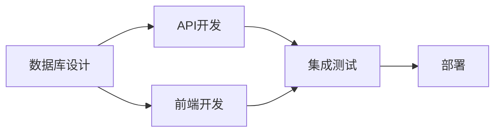

# Writing Plans - 编写计划

创建清晰、可执行的项目计划。

## 计划结构

### 基本模板
```markdown
# [任务名称] 实施计划

## 概述
[用 2-3 句话描述任务目标和价值]

## 目标 (SMART)
- **Specific**: [具体目标]
- **Measurable**: [可衡量的指标]
- **Achievable**: [可实现性分析]
- **Relevant**: [与业务目标的关系]
- **Time-bound**: [完成时间]

## 范围
### 包含
- [ ] 功能 1
- [ ] 功能 2

### 不包含
- [ ] 变体处理 (后续迭代)
- [ ] 性能优化 (v2.0)

## 步骤
### 阶段 1: [名称] (Day 1)
1. [具体步骤]
2. [具体步骤]

### 阶段 2: [名称] (Day 2-3)
1. [具体步骤]
2. [具体步骤]

## 时间线
```
Day 1     Day 2     Day 3     Day 4
  │         │         │         │
  ▼         ▼         ▼         ▼
设计 ──── 实现 ──── 测试 ──── 部署
```

## 资源需求
| 资源 | 数量 | 说明 |
|------|------|------|
| 前端开发 | 1 人 | React 专家 |
| 后端开发 | 1 人 | Node.js 专家 |
| 测试 | 0.5 人 | QA 支持 |

## 依赖
- [ ] 依赖任务 A (必须完成)
- [ ] 依赖服务 B (API 就绪)

## 风险评估
| 风险 | 概率 | 影响 | 应对 |
|------|------|------|------|
| 第三方 API 延迟 | 中 | 高 | Mock 数据先行 |
| 人员变动 | 低 | 中 | 文档完备 |

## 验收标准
- [ ] 所有测试通过
- [ ] 覆盖率 > 80%
- [ ] 文档已更新
- [ ] PM 验收通过
```

## SMART 原则应用

### 不好的目标 ❌
> "优化系统性能"

### 好的目标 ✅
> "将 API P99 响应时间从 800ms 优化到 200ms，在 2 周内完成"

### 分解示例
```markdown
## 性能优化目标

| 指标 | 当前值 | 目标值 | 截止日期 |
|------|--------|--------|----------|
| API P99 | 800ms | 200ms | 2 周后 |
| 首页加载 | 3s | 1s | 2 周后 |
| 错误率 | 5% | < 1% | 1 周后 |
```

## 依赖分析

### 依赖类型
1. **硬依赖**: 必须完成才能开始
2. **软依赖**: 可以并行但有影响
3. **反向依赖**: 完成后才解锁其他任务

### 依赖图


## 时间估算

### 参数化估算
```markdown
## 时间估算

基础时间 = 100 LOC / 小时
复杂度系数:
  - 简单 (CRUD): 1.0x
  - 中等 (业务逻辑): 1.5x
  - 复杂 (算法/系统): 2.5x

任务示例:
- 用户注册 API: 100 LOC × 1.5 = 2.5 小时
- 权限检查: 150 LOC × 2.5 = 6 小时
- 前端表单: 80 LOC × 1.0 = 1.5 小时
```

###三点估算
```markdown
## 三点估算

| 任务 | 乐观 | 最可能 | 悲观 | 期望 |
|------|------|--------|------|------|
| A | 2h | 4h | 8h | 4.3h |
| B | 1h | 2h | 4h | 2.2h |
| C | 4h | 8h | 16h | 8.7h |

期望时间 = (乐观 + 4×最可能 + 悲观) / 6
```

## 审查清单

- [ ] 目标是否符合 SMART
- [ ] 时间估算是否合理
- [ ] 依赖是否完整
- [ ] 风险是否有应对
- [ ] 验收标准是否清晰

## 与其他 Skills 配合

- [requirement-interview](requirement-interview): 需求澄清
- [multi-scheme-review](multi-scheme-review): 方案选择
- [staged-confirmation](staged-confirmation): 计划审批
